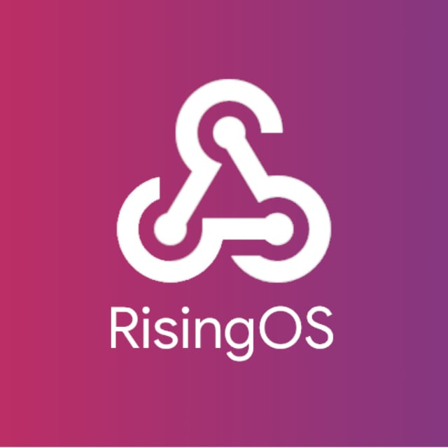

# Awesome CustomROM

Content Menu

- [Awesome CustomROM](#awesome-customrom)
  - [My Recommendations / Best ROMs](#my-recommendations--best-roms)
  - [Android Open Source Project (AOSP)](#android-open-source-project-aosp)
  - [Xiaomi ROMs](#xiaomi-roms)
  - [Recovery](#recovery)

## My Recommendations / Best ROMs

Here are some ROMs that I recommend, these are the best ones. Based on various factors such as features, stability, and community support.

|                             Icon                              |       ROM Name        | Development Status |                   Website                    |                    Github                    |                                 ROM Download / Sourceforge                                  |
| :-----------------------------------------------------------: | :-------------------: | :----------------: | :------------------------------------------: | :------------------------------------------: | :-----------------------------------------------------------------------------------------: |
|         |     **LineageOS**     |       Active       |      [Website](https://lineageos.org/)       |    [GitHub](https://github.com/LineageOS)    |                         [Download](https://download.lineageos.org/)                         |
|        |    **GrapheneOS**     |       Active       |        [Web](https://grapheneos.org/)        |   [GitHub](https://github.com/GrapheneOS)    |                         [Download](https://grapheneos.org/releases)                         |
|   | **Pixel Experience**  |    Discontinued    | [Web](https://download.pixelexperience.org/) | [GitHub](https://github.com/PixelExperience) |                      [Download](https://download.pixelexperience.org/)                      |
|          |     **RisingOS**      |       Active       |                Not Available                 |  [GitHub](https://github.com/RisingTechOSS)  |                                        Not Available                                        |
|  | **Afterlife Project** |       Active       |                Not Available                 |   [GitHub](https://github.com/after-life)    |       [Download](https://sourceforge.net/projects/afterlife-projects/files/release/)        |
|  | **Nusantara Project** |       Active       |       [Web](https://nusantararom.org/)       |  [GitHub](https://github.com/Nusantara-ROM)  |                                        Not Available                                        |
|           |      **PixelOS**      |       Active       |         [Web](https://pixelos.net/)          |  [GitHub](https://github.com/PixelOS-AOSP)   |            [Download](https://sourceforge.net/projects/pixelos-releases/files/)             |
|    |  **Project Matrixx**  |       Active       |         [Web](https://crdroid.net/)          | [GitHub](https://github.com/crdroidandroid)  |                          [Download](https://crdroid.net/downloads)                          |
|          |     **Xiaomi.EU**     |       Active       |        [Website](https://xiaomi.eu/)         |    [GitHub](https://github.com/xiaomieu)     | [Download](https://sourceforge.net/projects/xiaomi-eu-multilang-miui-roms/files/xiaomi.eu/) |

## Android Open Source Project (AOSP)

|                                 Icon                                  |               ROM Name               | Development Status |                       Website                       |                         Github                         |       ROM Download / Sourceforge        |
| :-------------------------------------------------------------------: | :----------------------------------: | :----------------: | :-------------------------------------------------: | :----------------------------------------------------: | :-------------------------------------: |
|                      |               **AICP**               |       Active       |       [Website](https://dwnld.aicp-rom.com/)        |           [GitHub](https://github.com/AICP)            | [Download](https://dwnld.aicp-rom.com/) |
|                    |             **AIM ROM**              |       Active       |        [Website](https://aimrom.github.io/)         |          [GitHub](https://github.com/AIMROM)           |  [Download](https://aimrom.github.io/)  |
|                |            **AlphaDroid**            |       Active       |   [GitHub](https://github.com/AlphaDroid-Project)   |    [GitHub](https://github.com/AlphaDroid-Project)     |             [Not Available]             |
|                 |            **AlrightOS**             |       Active       |          [Website](https://alrightos.xyz/)          | [GitHub](https://github.com/AlrightAndroid-Brokenlab)  |             [Not Available]             |
|                 |            **AmogOS Rom**            |       Active       |       [GitHub](https://github.com/AmogOS-Rom)       |        [GitHub](https://github.com/AmogOS-Rom)         |             [Not Available]             |
|                    |              **AmyROM**              |       Active       |            [Website](https://amyrom.ml/)            |          [GitHub](https://github.com/amyROM)           |             [Not Available]             |
|                 |            **Ancient OS**            |       Active       |          [Website](https://ancientrom.xyz)          |        [GitHub](https://github.com/Ancient-Lab)        |             [Not Available]             |
|                      |               **AOKP**               |       Active       |             [Website](http://aokp.co/)              |           [GitHub](https://github.com/AOKP)            |             [Not Available]             |
|              |          **AOSP Extended**           |       Active       |      [Website](https://www.aospextended.com/)       |       [GitHub](https://github.com/AospExtended)        |             [Not Available]             |
|                  |            **Aquari OS**             |       Active       |        [GitHub](https://github.com/AquariOS)        |         [GitHub](https://github.com/AquariOS)          |             [Not Available]             |
|                   |             **Arrow OS**             |       Active       |           [Website](https://arrowos.net/)           |          [GitHub](https://github.com/arrowos)          |             [Not Available]             |
|                  |            **Atomic OS**             |       Active       |       [GitHub](https://github.com/Atomic-OS)        |         [GitHub](https://github.com/Atomic-OS)         |             [Not Available]             |
|                  |             **BaikalOS**             |       Active       |        [GitHub](https://github.com/baikalos)        |         [GitHub](https://github.com/baikalos)          |             [Not Available]             |
|               |           **BananaDroid**            |       Active       |       [Website](http://www.bananadroid.com/)        |        [GitHub](https://github.com/bananadroid)        |             [Not Available]             |
|                 |            **BeastROMs**             |       Active       |       [GitHub](https://github.com/BeastRoms)        |         [GitHub](https://github.com/BeastRoms)         |             [Not Available]             |
|                  |            **Benzo ROM**             |       Active       |        [GitHub](https://github.com/BenzoRom)        |         [GitHub](https://github.com/BenzoRom)          |             [Not Available]             |
|             |          **Bianca Project**          |       Active       |     [GitHub](https://github.com/BiancaProject)      |       [GitHub](https://github.com/BiancaProject)       |             [Not Available]             |
|                 |            **Bliss ROMs**            |       Active       |          [Website](https://blissroms.com/)          |         [GitHub](https://github.com/BlissRoms)         |             [Not Available]             |
|            |         **Bootleggers ROM**          |       Active       |    [Website](https://bootleggersrom.github.io/)     |      [GitHub](https://github.com/BootleggersROM)       |             [Not Available]             |
|                    |              **BsdkOS**              |       Active       |         [GitHub](https://github.com/bsdkOS)         |          [GitHub](https://github.com/bsdkOS)           |             [Not Available]             |
|               |           **CAF Extended**           |       Active       |      [GitHub](https://github.com/CAF-Extended)      |       [GitHub](https://github.com/CAF-Extended)        |             [Not Available]             |
|                   |             **CalyxOS**              |       Active       |           [Website](https://calyxos.org/)           |          [GitHub](https://github.com/CalyxOS)          |             [Not Available]             |
|                 |            **CandyRoms**             |       Active       |          [Website](https://candyroms.org/)          |         [GitHub](https://github.com/CandyRoms)         |             [Not Available]             |
|                 |            **Carbon ROM**            |       Active       |          [Website](https://carbonrom.org/)          |         [GitHub](https://github.com/CarbonROM)         |             [Not Available]             |
|                |            **CatalystOS**            |       Active       |         [Website](https://catalystos.org/)          |     [GitHub](https://github.com/catalyst-android)      |             [Not Available]             |
|                  |            **Cesium OS**             |       Active       |          [Website](http://thecesiumos.me/)          |       [GitHub](https://github.com/CesiumOS-org)        |             [Not Available]             |
|                 |            **Cherish OS**            |       Active       |          [Website](https://cherishos.com/)          |         [GitHub](https://github.com/CherishOS)         |             [Not Available]             |
|                  |             **CipherOS**             |       Active       |       [Website](https://cipheros.github.io/)        |         [GitHub](https://github.com/CipherOS)          |             [Not Available]             |
|                 |            **Citrus CAF**            |       Active       |       [GitHub](https://github.com/Citrus-CAF)       |        [GitHub](https://github.com/Citrus-CAF)         |             [Not Available]             |
|                    |             **Colt OS**              |       Active       |      [GitHub](https://github.com/Colt-Enigma)       |        [GitHub](https://github.com/Colt-Enigma)        |             [Not Available]             |
|                 |            **ConquerOS**             |       Active       |       [GitHub](https://github.com/ConquerOS)        |         [GitHub](https://github.com/ConquerOS)         |             [Not Available]             |
|                 |            **Corvus ROM**            |       Active       |      [GitHub](https://github.com/Corvus-AOSP)       |        [GitHub](https://github.com/Corvus-AOSP)        |             [Not Available]             |
|                  |            **Cosmic OS**             |       Active       |       [Website](https://cosmic-os.github.io/)       |         [GitHub](https://github.com/Cosmic-OS)         |             [Not Available]             |
|                   |             **CrDroid**              |       Active       |           [Website](https://crdroid.net/)           |      [GitHub](https://github.com/crdroidandroid)       |             [Not Available]             |
|                 |            **Cygnus ROM**            |       Active       |          [Website](https://cygnusos.com/)           |        [GitHub](https://github.com/cygnus-rom)         |             [Not Available]             |
|                  |            **Cypher OS**             |       Active       |        [GitHub](https://github.com/CypherOS)        |         [GitHub](https://github.com/CypherOS)          |             [Not Available]             |
|                  |             **Derpfest**             |       Active       |          [Website](https://derpfest.org/)           |          [GitHub](https://github.com/DerpLab)          |             [Not Available]             |
|               |           **Descendant X**           |       Active       |          [Website](https://descendant.me/)          |        [GitHub](https://github.com/Descendant)         |             [Not Available]             |
|             |          **Dirty Unicorns**          |       Active       |        [Website](https://dirtyunicorns.com/)        |       [GitHub](https://github.com/DirtyUnicorns)       |             [Not Available]             |
|                  |             **DivestOS**             |       Active       |           [Website](https://divestos.org)           |      [GitHub](https://github.com/divested-mobile)      |             [Not Available]             |
|                     |              **Dot OS**              |       Active       |       [Website](https://www.droidontime.com/)       |           [GitHub](https://github.com/DotOS)           |             [Not Available]             |
|                  |            **DroidX-UI**             |       Active       | [Website](https://droid-x-ui-github-io.vercel.app/) |         [GitHub](https://github.com/DroidX-UI)         |             [Not Available]             |
|                   |             **Darkron**              |       Active       |           [Website](https://darkron.io/)            |          [GitHub](https://github.com/Darkron)          |             [Not Available]             |
|                   |             **Delta OS**             |       Active       |        [GitHub](https://github.com/Delta-OS)        |         [GitHub](https://github.com/Delta-OS)          |             [Not Available]             |
|                    |              **Derpix**              |       Active       |     [GitHub](https://github.com/Derpix-Project)     |      [GitHub](https://github.com/Derpix-Project)       |             [Not Available]             |
|                 |           **Desperado OS**           |       Active       |      [GitHub](https://github.com/Desperado-OS)      |       [GitHub](https://github.com/Desperado-OS)        |             [Not Available]             |
|                   |             **Dharios**              |       Active       |      [GitHub](https://github.com/Dharios-Rom)       |        [GitHub](https://github.com/Dharios-Rom)        |             [Not Available]             |
|                |            **DianaDroid**            |       Active       |       [GitHub](https://github.com/DianaDroid)       |        [GitHub](https://github.com/DianaDroid)         |             [Not Available]             |
|               |           **Dinosaurs OS**           |       Active       |      [GitHub](https://github.com/Dinosaurs-OS)      |       [GitHub](https://github.com/Dinosaurs-OS)        |             [Not Available]             |
|                      |               **Dios**               |       Active       |        [GitHub](https://github.com/DiosAOSP)        |         [GitHub](https://github.com/DiosAOSP)          |             [Not Available]             |
|                |            **DotProject**            |       Active       |         [GitHub](https://github.com/DotOS)          |           [GitHub](https://github.com/DotOS)           |             [Not Available]             |
|                |            **DracaenaOS**            |       Active       |       [GitHub](https://github.com/DracaenaOS)       |        [GitHub](https://github.com/DracaenaOS)         |             [Not Available]             |
|              |         **Dragon Flames OS**         |       Active       |     [GitHub](https://github.com/Dragon-Flames)      |       [GitHub](https://github.com/Dragon-Flames)       |             [Not Available]             |
|              |          **Droid Inferno**           |       Active       |      [GitHub](https://github.com/DroidInferno)      |       [GitHub](https://github.com/DroidInferno)        |             [Not Available]             |
|                |            **DroidOnRod**            |       Active       |       [GitHub](https://github.com/DroidOnRod)       |        [GitHub](https://github.com/DroidOnRod)         |             [Not Available]             |
|                 |            **DrunkenOS**             |       Active       |       [GitHub](https://github.com/DrunkenOS)        |         [GitHub](https://github.com/DrunkenOS)         |             [Not Available]             |
|                  |             **DustyOS**              |       Active       |        [GitHub](https://github.com/DustyOS)         |          [GitHub](https://github.com/DustyOS)          |             [Not Available]             |
|                 |            **DynamicOS**             |       Active       |       [GitHub](https://github.com/DynamicOS)        |         [GitHub](https://github.com/DynamicOS)         |             [Not Available]             |
|                   |             **Easyron**              |       Active       |        [GitHub](https://github.com/Easyron)         |          [GitHub](https://github.com/Easyron)          |             [Not Available]             |
|                  |             **Ecstatic**             |       Active       |       [GitHub](https://github.com/EcstaticOS)       |        [GitHub](https://github.com/EcstaticOS)         |             [Not Available]             |
|                |           **Evolution X**            |       Active       |         [Website](https://evolution-x.org/)         |        [GitHub](https://github.com/Evolution-X)        |             [Not Available]             |
|              |          **Exthm Project**           |       Active       |     [GitHub](https://github.com/Exthm-Project)      |       [GitHub](https://github.com/Exthm-Project)       |             [Not Available]             |
|              |          **FakeM Battery**           |       Active       |     [GitHub](https://github.com/FakeM-Project)      |       [GitHub](https://github.com/FakeM-Project)       |             [Not Available]             |
|                 |            **Feyren OS**             |       Active       |       [GitHub](https://github.com/Feyren-OS)        |         [GitHub](https://github.com/Feyren-OS)         |             [Not Available]             |
|                     |              **Fluid**               |       Active       |     [GitHub](https://github.com/fluid-project)      |       [GitHub](https://github.com/fluid-project)       |             [Not Available]             |
|              |          **Forkphorus OS**           |       Active       |     [GitHub](https://github.com/Forkphorus-OS)      |       [GitHub](https://github.com/Forkphorus-OS)       |             [Not Available]             |
|               |           **FOSS Project**           |       Active       |      [GitHub](https://github.com/FOSS-Project)      |       [GitHub](https://github.com/FOSS-Project)        |             [Not Available]             |
|                   |             **Fryu OS**              |       Active       |         [GitHub](https://github.com/FryuOS)         |          [GitHub](https://github.com/FryuOS)           |             [Not Available]             |
|                   |             **GAN ROM**              |       Active       |        [GitHub](https://github.com/GAN-ROM)         |          [GitHub](https://github.com/GAN-ROM)          |             [Not Available]             |
|                 |           **Gearshift OS**           |       Active       |      [GitHub](https://github.com/Gearshift-OS)      |       [GitHub](https://github.com/Gearshift-OS)        |             [Not Available]             |
|                |           **Geno Sphinx**            |       Active       |      [GitHub](https://github.com/Geno-Sphinx)       |        [GitHub](https://github.com/Geno-Sphinx)        |             [Not Available]             |
|                   |           **Gladios ROM**            |       Active       |       [GitHub](https://github.com/GladiosROM)       |        [GitHub](https://github.com/GladiosROM)         |             [Not Available]             |
|            |         **Golfish Project**          |       Active       |    [GitHub](https://github.com/Golfish-Project)     |      [GitHub](https://github.com/Golfish-Project)      |             [Not Available]             |
|                  |            **GrapheneOS**            |       Active       |         [Website](https://grapheneos.org/)          |        [GitHub](https://github.com/GrapheneOS)         |             [Not Available]             |
|                   |            **Halogen OS**            |       Active       |          [Website](https://halogenos.org/)          |         [GitHub](https://github.com/halogenOS)         |             [Not Available]             |
|                   |            **Havocos OS**            |       Active       |       [GitHub](https://github.com/Havocos-OS)       |        [GitHub](https://github.com/Havocos-OS)         |             [Not Available]             |
|                     |             **Havoc OS**             |       Active       |          [Website](https://havoc-os.com/)           |         [GitHub](https://github.com/Havoc-OS)          |             [Not Available]             |
|                  |             **HentaiOS**             |       Active       |     [Website](https://downloads.hentaios.com/)      |         [GitHub](https://github.com/hentaiOS)          |             [Not Available]             |
|                   |             **HyconOS**              |       Active       |        [GitHub](https://github.com/HyconOS)         |          [GitHub](https://github.com/HyconOS)          |             [Not Available]             |
|                     |              **Ion OS**              |       Active       |         [GitHub](https://github.com/i-o-n)          |           [GitHub](https://github.com/i-o-n)           |             [Not Available]             |
|                    |            **iodéOS OS**             |       Active       |          [GitHub](https://gitlab.com/iode)          |         [GitHub](https://iode.tech/iodeos-en)          |             [Not Available]             |
|             |          **IronOS Project**          |       Active       |     [GitHub](https://github.com/IronOSProject)      |       [GitHub](https://github.com/IronOSProject)       |             [Not Available]             |
|                    |             **Kang OS**              |       Active       |       [GitHub](https://github.com/Kang-OS-R)        |         [GitHub](https://github.com/Kang-OS-R)         |             [Not Available]             |
|                  |            **Komodo OS**             |       Active       |         [Website](https://komodo-os.my.id/)         |         [GitHub](https://github.com/Komodo-OS)         |             [Not Available]             |
|                 |   **Krypton Open Source Project**    |       Active       |      [GitHub](https://github.com/AOSP-Krypton)      |       [GitHub](https://github.com/AOSP-Krypton)        |             [Not Available]             |
|                  |            **Legion OS**             |       Active       |           [Website](http://legionos.tk/)            |     [GitHub](https://github.com/Project-LegionOS)      |             [Not Available]             |
|          |         **LightningFastRom**         |       Active       |    [GitHub](https://github.com/lightningfastrom)    |     [GitHub](https://github.com/lightningfastrom)      |             [Not Available]             |
|                 |            **Lineage OS**            |       Active       |          [Website](https://lineageos.org/)          |         [GitHub](https://github.com/LineageOS)         |             [Not Available]             |
|               |           **Liquid Remix**           |       Active       |      [GitHub](https://github.com/LiquidRemix)       |        [GitHub](https://github.com/LiquidRemix)        |             [Not Available]             |
|                 |            **LLuvia OS**             |       Active       |        [GitHub](https://github.com/LLuviaOS)        |         [GitHub](https://github.com/LLuviaOS)          |             [Not Available]             |
|                  |            **Magnus OS**             |       Active       |       [GitHub](https://github.com/Magnus-OS)        |         [GitHub](https://github.com/Magnus-OS)         |             [Not Available]             |
|                   |             **Mallu OS**             |       Active       |        [GitHub](https://github.com/MalluOS)         |          [GitHub](https://github.com/MalluOS)          |             [Not Available]             |
|                  |            **MoKee ROM**             |       Active       |       [Website](https://www.mokeedev.com/en/)       |           [GitHub](https://github.com/MoKee)           |             [Not Available]             |
|                |           **MSM Xtended**            |       Active       |    [GitHub](https://github.com/Project-Xtended)     |      [GitHub](https://github.com/Project-Xtended)      |             [Not Available]             |
|               |           **Nethunter OS**           |       Active       |     [Web](https://www.kali.org/docs/nethunter/)     |    [Gitlab](https://gitlab.com/kalilinux/nethunter)    |             [Not Available]             |
|               |           **NightskyROM**            |       Active       |      [GitHub](https://github.com/NightskyROM)       |        [GitHub](https://github.com/NightskyROM)        |             [Not Available]             |
|                |           **Nitrogen OS**            |       Active       |    [GitHub](https://github.com/nitrogen-project)    |     [GitHub](https://github.com/nitrogen-project)      |             [Not Available]             |
|          |        **Nusantara Project**         |       Active       |          [Web](https://nusantararom.org/)           |       [GitHub](https://github.com/Nusantara-ROM)       |             [Not Available]             |
|                  |            **Octavi OS**             |       Active       |   [Web](https://downloads.octavi-os.com/?dir=GSI)   |      [GitHub](https://github.com/Octavi-Staging)       |             [Not Available]             |
|                   |             **Omni ROM**             |       Active       |             [Web](https://omnirom.org/)             |          [GitHub](https://github.com/omnirom)          |             [Not Available]             |
|               |           **PalladiumOS**            |       Active       |      [GitHub](https://github.com/Palladium-OS)      |       [GitHub](https://github.com/Palladium-OS)        |             [Not Available]             |
|           |         **Paranoid Android**         |       Active       |              [Web](https://aospa.co/)               |           [GitHub](https://github.com/AOSPA)           |             [Not Available]             |
|               |           **PhoenixAOSP**            |       Active       |      [GitHub](https://github.com/PhoenixAOSP)       |        [GitHub](https://github.com/PhoenixAOSP)        |             [Not Available]             |
|            |         **Pixel Blaster OS**         |       Active       |      [Web](https://pixelblaster-os.github.io/)      |      [GitHub](https://github.com/PixelBlaster-OS)      |             [Not Available]             |
|                 |            **Pixel Dust**            |       Active       |  [GitHub](https://github.com/PixelDust-Project-X)   |    [GitHub](https://github.com/PixelDust-Project-X)    |             [Not Available]             |
|           |         **Pixel Experience**         |       Active       |    [Web](https://download.pixelexperience.org/)     |      [GitHub](https://github.com/PixelExperience)      |             [Not Available]             |
|          |        **PixelExtended ROM**         |       Active       |          [Web](https://pixelextended.me/)           |       [GitHub](https://github.com/PixelExtended)       |             [Not Available]             |
|               |           **PixelPlusUI**            |       Active       |              [Web](https://ppui.site/)              |     [GitHub](https://github.com/PixelPlusUI-Elle)      |             [Not Available]             |
|                   |             **PixelOS**              |       Active       |             [Web](https://pixelos.net/)             |       [GitHub](https://github.com/PixelOS-AOSP)        |             [Not Available]             |
|                   |             **Pixys OS**             |       Active       |        [Web](https://downloads.pixysos.com/)        |          [GitHub](https://github.com/PixysOS)          |             [Not Available]             |
|                      |               **POSP**               |       Active       |          [Web](https://potatoproject.co/)           |       [GitHub](https://github.com/PotatoProject)       |             [Not Available]             |
|                |           **Project 404**            |       Active       |           [Web](https://project404.xyz/)            |           [GitHub](https://github.com/P-404)           |             [Not Available]             |
|             |          **Project Arcana**          |       Active       |    [Web](https://projectarcana-aosp.github.io/)     |    [GitHub](https://github.com/projectarcana-aosp)     |             [Not Available]             |
|             |          **Project Awaken**          |       Active       |         [Web](https://awakenos.vercel.app/)         |      [GitHub](https://github.com/Project-Awaken)       |             [Not Available]             |
|              |          **Project Blaze**           |       Active       |         [Web](https://www.projectblaze.in/)         |       [GitHub](https://github.com/ProjectBlaze)        |             [Not Available]             |
|             |          **Project Elixir**          |       Active       |       [Web](https://projectelixiros.com/home)       |      [GitHub](https://github.com/Project-Elixir)       |             [Not Available]             |
|       |       **Project Kaleidoscope**       |       Active       |          [Web](https://kaleidoscope.ink/)           |   [GitHub](https://github.com/Project-Kaleidoscope)    |             [Not Available]             |
|             |          **Project Kasumi**          |       Active       |                   [Not Available]                   |       [GitHub](https://github.com/ProjectKasumi)       |             [Not Available]             |
|         |        **Project Lighthouse**        |       Active       |         [Web](https://lighthouse-os.tech/)          |       [GitHub](https://github.com/lighthouse-os)       |             [Not Available]             |
|           |         **Project Mushroom**         |       Active       |                   [Not Available]                   |     [GitHub](https://github.com/Project-Mushroom)      |             [Not Available]             |
|            |         **Project Matrixx**          |       Active       |      [Web](https://projectmatrixx.github.io/)       |      [GitHub](https://github.com/ProjectMatrixx)       |             [Not Available]             |
|            |         **Project Radiant**          |       Active       |                   [Not Available]                   |      [GitHub](https://github.com/ProjectRadiant)       |             [Not Available]             |
|             |          **Project Sakura**          |       Active       |          [Web](https://projectsakura.xyz/)          |       [GitHub](https://github.com/ProjectSakura)       |             [Not Available]             |
|             |          **Project Streak**          |       Active       |          [Web](https://projectstreak.pl/)           |       [GitHub](https://github.com/ProjectStreak)       |             [Not Available]             |
|           |         **Project Titanium**         |       Active       |                   [Not Available]                   |     [GitHub](https://github.com/Project-Titanium)      |             [Not Available]             |
|           |         **Project Zephyrus**         |       Active       |     [Web](https://zephyrus-website.vercel.app/)     |     [GitHub](https://github.com/Project-Zephyrus)      |             [Not Available]             |
|                |           **Proton AOSP**            |       Active       |           [Web](https://protonaosp.org/)            |        [GitHub](https://github.com/ProtonAOSP)         |             [Not Available]             |
|                |            **ReloadedOS**            |       Active       |           [Web](https://reloadedos.org/)            |        [GitHub](https://github.com/ReloadedOS)         |             [Not Available]             |
|         |      **Resurrection Remix OS**       |       Active       |        [Web](https://resurrectionremix.com/)        |     [GitHub](https://github.com/ResurrectionRemix)     |             [Not Available]             |
|  |    **ResurrectionRemix-Revived**     |       Active       |        [Web](https://resurrectionremix.com/)        | [GitHub](https://github.com/ResurrectionRemix-Revived) |             [Not Available]             |
|                 |            **Revenge OS**            |       Active       |                   [Not Available]                   |         [GitHub](https://github.com/RevengeOS)         |             [Not Available]             |
|             | **Rising Tech Open Source Software** |       Active       |                   [Not Available]                   |       [GitHub](https://github.com/RisingTechOSS)       |             [Not Available]             |
|                   |             **RohieOS**              |       Active       |                   [Not Available]                   |          [GitHub](https://github.com/RohieOS)          |             [Not Available]             |
|               |           **Scorpion ROM**           |       Active       |           [Web](https://scorpionrom.com/)           |        [GitHub](https://github.com/ScorpionRom)        |             [Not Available]             |
|                  |             **SerasaOS**             |       Active       |        [GitHub](https://github.com/SerasaOS)        |         [GitHub](https://github.com/SerasaOS)          |             [Not Available]             |
|              |          **ShapeShift OS**           |       Active       |      [GitHub](https://github.com/ShapeShiftOS)      |       [GitHub](https://github.com/ShapeShiftOS)        |             [Not Available]             |
|                 |            **SkyLineUI**             |       Active       |       [GitHub](https://github.com/SkylineUI)        |         [GitHub](https://github.com/SkylineUI)         |             [Not Available]             |
|                  |             **SlimRoms**             |       Active       |            [Web](https://slimroms.org/)             |         [GitHub](https://github.com/slimroms)          |             [Not Available]             |
|                    |              **SoniUI**              |       Active       |      [GitHub](https://github.com/XOSP-Reborn)       |        [GitHub](https://github.com/XOSP-Reborn)        |             [Not Available]             |
|                   |             **SparkOS**              |       Active       |          [Web](https://www.spark-os.live/)          |         [GitHub](https://github.com/Spark-Rom)         |             [Not Available]             |
|                   |             **Spice OS**             |       Active       |        [GitHub](https://github.com/SpiceOS)         |          [GitHub](https://github.com/SpiceOS)          |             [Not Available]             |
|                    |             **Stag OS**              |       Active       |             [Web](https://stag-os.org/)             |          [GitHub](https://github.com/StagOS)           |             [Not Available]             |
|                  |            **StatiX OS**             |       Active       |        [GitHub](https://github.com/StatiXOS)        |         [GitHub](https://github.com/StatiXOS)          |             [Not Available]             |
|                |           **Superior OS**            |       Active       |        [Web](https://superioros.github.io/)         |        [GitHub](https://github.com/SuperiorOS)         |             [Not Available]             |
|                 |            **Syberia OS**            |       Active       |            [Web](https://syberiaos.com/)            |      [GitHub](https://github.com/syberia-project)      |             [Not Available]             |
|                    |              **TenXOS**              |       Active       |        [GitHub](https://github.com/TenX-OS)         |          [GitHub](https://github.com/TenX-OS)          |             [Not Available]             |
|                 |            **Tequila OS**            |       Active       |       [GitHub](https://github.com/tequilaOS)        |         [GitHub](https://github.com/tequilaOS)         |             [Not Available]             |
|          |        **The Kraken Project**        |       Active       |         [GitHub](https://github.com/AOSPK)          |           [GitHub](https://github.com/AOSPK)           |             [Not Available]             |
|            |         **The Styx Project**         |       Active       |           [Web](https://styxproject.ml/)            |        [GitHub](https://github.com/StyxProject)        |             [Not Available]             |
|      |      **The XPerience Project**       |       Active       |  [GitHub](https://github.com/TheXPerienceProject)   |    [GitHub](https://github.com/TheXPerienceProject)    |             [Not Available]             |
|                   |             **Tipsy OS**             |       Active       |        [GitHub](https://github.com/TipsyOs)         |          [GitHub](https://github.com/TipsyOs)          |             [Not Available]             |
|                   |             **Toxyc OS**             |       Active       |        [GitHub](https://github.com/ToxycOS)         |          [GitHub](https://github.com/ToxycOS)          |             [Not Available]             |
|                 |            **Validus OS**            |       Active       |       [GitHub](https://github.com/ValidusOs)        |         [GitHub](https://github.com/ValidusOs)         |             [Not Available]             |
|                   |             **Viper OS**             |       Active       |          [Web](https://viperos.gitlab.io/)          |          [GitHub](https://github.com/ViperOS)          |             [Not Available]             |
|                    |              **VoidUI**              |       Active       |         [GitHub](https://github.com/VoidUI)         |          [GitHub](https://github.com/VoidUI)           |             [Not Available]             |
|                 |            **Voltage OS**            |       Active       |       [GitHub](https://github.com/VoltageOS)        |         [GitHub](https://github.com/VoltageOS)         |             [Not Available]             |
|                    |              **WaveOS**              |       Active       |      [GitHub](https://github.com/Wave-Project)      |       [GitHub](https://github.com/Wave-Project)        |             [Not Available]             |
|               |           **Weeb Projekt**           |       Active       |      [GitHub](https://github.com/weebproject)       |        [GitHub](https://github.com/weebproject)        |             [Not Available]             |
|                 |            **Xdroid CAF**            |       Active       |       [GitHub](https://github.com/xdroid-CAF)       |        [GitHub](https://github.com/xdroid-CAF)         |             [Not Available]             |
|                 |            **Xdroid OS**             |       Active       |       [GitHub](https://github.com/xdroid-oss)       |        [GitHub](https://github.com/xdroid-oss)         |             [Not Available]             |
|                   |             **Xenon HD**             |       Active       |           [Web](https://www.xenonhd.com/)           |        [GitHub](https://github.com/TeamHorizon)        |             [Not Available]             |
|                  |            **YAAP AOSP**             |       Active       |          [GitHub](https://github.com/yaap)          |           [GitHub](https://github.com/yaap)            |             [Not Available]             |
|                    |              **ZeusOS**              |       Active       |        [GitHub](https://github.com/Zeus-OS)         |          [GitHub](https://github.com/Zeus-OS)          |             [Not Available]             |

## Xiaomi ROMs

|                           Icon                           |        ROM Name        | Development Status |                          Website                           |                Github                 |       ROM Download / Sourceforge        |
| :------------------------------------------------------: | :--------------------: | :----------------: | :--------------------------------------------------------: | :-----------------------------------: | :-------------------------------------: |
|     |     **Xiaomi.EU**      |       Active       |               [Website](https://xiaomi.eu/)                | [GitHub](https://github.com/xiaomieu) | [Download](https://download.xiaomi.eu/) |
|        |     **Abhix MIUI**     |        meow        |         [Telegram](https://t.me/ROGEditionUPDATES)         |                 meow                  |                  meow                   |
|    |   **MIUI EliteRoms**   |        meow        |       [Telegram](https://t.me/EliteDevelopmentforMi)       |                 meow                  |                  meow                   |
|      |      **MIUI EU**       |        meow        |            [Web](https://xiaomi.eu/community/)             |                 meow                  |                  meow                   |
|  |    **MIUI Global**     |        meow        |     [Web](https://c.mi.com/global/miuidownload/index)      |                 meow                  |                  meow                   |
|   |     **MIUI OneOS**     |        meow        |      [Web](https://sourceforge.net/projects/one-os/)       |                 meow                  |                  meow                   |
|     |      **MIUI Pro**      |        meow        |                [Web](https://miuipro.info/)                |                 meow                  |                  meow                   |
|  |    **MIUI Reborn**     |        meow        |            [Telegram](https://t.me/reborn_dll)             |                 meow                  |                  meow                   |
|   |     **MIUI RevOS**     |        meow        | [Web](https://sourceforge.net/projects/revolutionos-miui/) |                 meow                  |                  meow                   |
|      |      **MIUI TR**       |        meow        |      [Web](https://forum.miuitr.info/bolum/miuitr.5/)      |                 meow                  |                  meow                   |
|      |      **MIUI VN**       |        meow        |     [Github](https://sourceforge.net/projects/miuivn/)     |                 meow                  |                  meow                   |
|      |    **MIUI HT Plus**    |        meow        |     [Github](https://sourceforge.net/projects/miuivn/)     |                 meow                  |                  meow                   |
|      |    **MIUI EdithOS**    |        meow        |     [Github](https://sourceforge.net/projects/miuivn/)     |                 meow                  |                  meow                   |
|      | **MIUI Verse Edition** |        meow        |     [Github](https://sourceforge.net/projects/miuivn/)     |                 meow                  |                  meow                   |
|      |   **MIUI HeavenUI**    |        meow        |     [Github](https://sourceforge.net/projects/miuivn/)     |                 meow                  |                  meow                   |
|      |   **MIUI RemodedUI**   |        meow        |     [Github](https://sourceforge.net/projects/miuivn/)     |                 meow                  |                  meow                   |
|      |     **MIUI Eris**      |        meow        |     [Github](https://sourceforge.net/projects/miuivn/)     |                 meow                  |                  meow                   |
|      |    **MIUI GoPlus**     |        meow        |     [Github](https://sourceforge.net/projects/miuivn/)     |                 meow                  |                  meow                   |
|      |    **MIUI WaveUI**     |        meow        |     [Github](https://sourceforge.net/projects/miuivn/)     |                 meow                  |                  meow                   |
|      |    **MIUI MicroUI**    |        meow        |     [Github](https://sourceforge.net/projects/miuivn/)     |                 meow                  |                  meow                   |
|      |      **MIUI AR**       |        meow        |     [Github](https://sourceforge.net/projects/miuivn/)     |                 meow                  |                  meow                   |
|      |   **MIUI OptimumOS**   |        meow        |     [Github](https://sourceforge.net/projects/miuivn/)     |                 meow                  |                  meow                   |

## Recovery

|                          Icon                           |            Recovery Name             |                         Github                         |                    Website                    |
| :-----------------------------------------------------: | :----------------------------------: | :----------------------------------------------------: | :-------------------------------------------: |
|   |        **OrangeFox Recovery**        |         [Gitlab](https://gitlab.com/OrangeFox)         |     [Website](https://orangefox.download)     |
|  |   **Pitch Black Recovery Project**   | [Github](https://github.com/PitchBlackRecoveryProject) |  [Website](https://pitchblackrecovery.com/)   |
|    |        **Pterodon Recovery**         |     [Github](https://github.com/PterodonRecovery)      |
|     |     **RedWolf Recovery Project**     |      [Github](https://github.com/RedWolfRecovery)      | [Website](https://redwolfrecovery.github.io/) |
|        | **SHRP – Sky Hawk Recovery Project** |           [Github](https://github.com/SHRP)            | [Website](https://skyhawkrecovery.github.io/) |
|        | **TWRP – Team Win Recovery Project** |          [Github](https://github.com/TeamWin)          |          [Website](https://twrp.me/)          |
