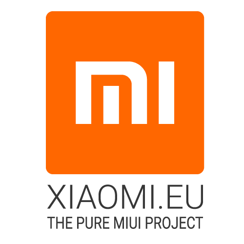

<h1 align="center">Awesome CustomROM</h1>

  

#### Also Visit: [Awesome-AndroidROM](https://github.com/ImKKingshuk/Awesome-AndroidROM) to dive into a collection of official Android ROMs from manufacturers.

  

### Content Menu

- [My Recommendations / Best ROMs](#my-recommendations--best-roms)
- [Android Open Source Project (AOSP) ROMs](#android-open-source-project-aosp-roms)
- [Xiaomi HyperOS / MIUI ROMs](#xiaomi-hyperos--miui-roms)
- [Custom Recovery Projects](#custom-recovery-projects)
- [Root / SuperUser Tools](#root--superuser-tools)

## My Recommendations / Best ROMs

Here some ROMs that I recommend, these are the best ones. Based on various factors such as features, stability, and community support.

|                                  Icon                                   |       ROM Name        | Development Status |                     Website                      |                             Github                              |                                 ROM Download / Sourceforge                                  |
| :---------------------------------------------------------------------: | :-------------------: | :----------------: | :----------------------------------------------: | :-------------------------------------------------------------: | :-----------------------------------------------------------------------------------------: |
|  |      **HyperIN**      |       Active       |      [Website](https://hyperin.vercel.app/)      | [GitHub](https://github.com/HyperIN-The-Ultra-Pure-HyperOS-ROM) |                      [Download](https://hyperin.vercel.app/Downloads)                       |
|  |     **RisingOS**      |       Active       |                  Not Available                   |           [GitHub](https://github.com/RisingTechOSS)            |            [Download](https://sourceforge.net/projects/risingos-official/files/)            |
|  | **Afterlife Project** |       Active       |                  Not Available                   |         [GitHub](https://github.com/AfterLifePrjktAOSP)         |       [Download](https://sourceforge.net/projects/afterlife-projects/files/release/)        |
|  |  **Project Matrixx**  |       Active       |    [Website](https://www.projectmatrixx.org/)    |           [GitHub](https://github.com/ProjectMatrixx)           |                    [Download](https://www.projectmatrixx.org/downloads)                     |
|    |     **Xiaomi.EU**     |       Active       |          [Website](https://xiaomi.eu/)           |                         [Not Available]                         | [Download](https://sourceforge.net/projects/xiaomi-eu-multilang-miui-roms/files/xiaomi.eu/) |
|   | **Nusantara Project** |       Active       |       [Website](https://nusantararom.org/)       |           [GitHub](https://github.com/Nusantara-ROM)            |                        [Download](https://nusantararom.org/device/)                         |
|    |      **crDroid**      |       Active       |         [Website](https://crdroid.net/)          |           [GitHub](https://github.com/crdroidandroid)           |                          [Download](https://crdroid.net/downloads)                          |
|  |    **Evolution X**    |       Active       |       [Website](https://evolution-x.org/)        |            [GitHub](https://github.com/Evolution-X)             |                        [Download](https://evolution-x.org/download)                         |
|   |    **GrapheneOS**     |       Active       |        [Website](https://grapheneos.org/)        |             [GitHub](https://github.com/GrapheneOS)             |                             [Download](https://grapheneos.org/)                             |
|   |     **LineageOS**     |       Active       |        [Website](https://lineageos.org/)         |             [GitHub](https://github.com/LineageOS)              |                         [Download](https://download.lineageos.org/)                         |
|    | **Paranoid Android**  |       Active       |      [Website](https://paranoidandroid.co/)      |               [GitHub](https://github.com/AOSPA)                |                           [Download](https://paranoidandroid.co/)                           |
|   |      **PixelOS**      |       Active       |         [Website](https://pixelos.net/)          |            [GitHub](https://github.com/PixelOS-AOSP)            |            [Download](https://sourceforge.net/projects/pixelos-releases/files/)             |
|  |    **SomethingOS**    |       Active       |        [Website](https://somethingos.com)        |            [GitHub](https://github.com/SomethingOS)             |                        [Download](https://somethingos.com/downloads)                        |
|   |      **CalyxOS**      |       Active       |         [Website](https://calyxos.org/)          |              [GitHub](https://github.com/CalyxOS)               |                                       [Not Available]                                       |
|   | **Pixel Experience**  |    Discontinued    | [Website](https://download.pixelexperience.org/) |          [GitHub](https://github.com/PixelExperience)           |                      [Download](https://download.pixelexperience.org/)                      |
|   |  **Project Elixir**   |    Discontinued    |     [Website](https://projectelixiros.com/)      |           [GitHub](https://github.com/Project-Elixir)           |                          [Download](https://projectelixiros.com/)                           |

## Android Open Source Project (AOSP) ROMs

|                                     Icon                                     |               ROM Name               | Development Status |                       Website                       |                         Github                         |                ROM Download / Sourceforge                |
| :--------------------------------------------------------------------------: | :----------------------------------: | :----------------: | :-------------------------------------------------: | :----------------------------------------------------: | :------------------------------------------------------: |
|       |           **2by2 Project**           |       Active       |         [Website](https://project2by2.jp/)          |       [GitHub](https://github.com/2by2-Project)        |           [Download](https://project2by2.jp/)            |
|       |      **Advanced XPerience OS**       |       Active       |        [Website](https://axp.binbash.rocks/)        |          [GitHub](https://github.com/AXP-OS)           |          [Download](https://github.com/AXP-OS)           |
|       |           **AfterlifeOS**            |       Active       |         [Website](https://afterlifeos.com/)         |        [GitHub](https://github.com/AfterlifeOS)        |           [Download](https://afterlifeos.com/)           |
|         |               **AICP**               |       Active       |       [Website](https://dwnld.aicp-rom.com/)        |           [GitHub](https://github.com/AICP)            |         [Download](https://dwnld.aicp-rom.com/)          |
|        |             **AIM ROM**              |       Active       |        [Website](https://aimrom.github.io/)         |          [GitHub](https://github.com/AIMROM)           |          [Download](https://aimrom.github.io/)           |
|       |            **AlphaDroid**            |       Active       |                   [Not Available]                   |    [GitHub](https://github.com/AlphaDroid-Project)     |                     [Not Available]                      |
|       |            **AlrightOS**             |       Active       |          [Website](https://alrightos.xyz/)          | [GitHub](https://github.com/AlrightAndroid-Brokenlab)  |                     [Not Available]                      |
|       |            **AmogOS Rom**            |       Active       |                   [Not Available]                   |        [GitHub](https://github.com/AmogOS-Rom)         |                     [Not Available]                      |
|        |              **AmyROM**              |       Active       |            [Website](https://amyrom.ml/)            |          [GitHub](https://github.com/amyROM)           |                     [Not Available]                      |
|        |            **Ancient OS**            |       Active       |          [Website](https://ancientrom.xyz)          |        [GitHub](https://github.com/Ancient-Lab)        |                     [Not Available]                      |
|         |               **AOKP**               |    Discontinued    |             [Website](http://aokp.co/)              |           [GitHub](https://github.com/AOKP)            |                     [Not Available]                      |
|        |          **AOSP Extended**           |       Active       |      [Website](https://www.aospextended.com/)       |       [GitHub](https://github.com/AospExtended)        |                     [Not Available]                      |
|        |            **Aquari OS**             |    Discontinued    |                   [Not Available]                   |         [GitHub](https://github.com/AquariOS)          |                     [Not Available]                      |
|        |             **Arrow OS**             |       Active       |           [Website](https://arrowos.net/)           |          [GitHub](https://github.com/arrowos)          |                     [Not Available]                      |
|        |            **Atomic OS**             |    Discontinued    |                   [Not Available]                   |         [GitHub](https://github.com/Atomic-OS)         |                     [Not Available]                      |
|        |             **BaikalOS**             |       Active       |                   [Not Available]                   |         [GitHub](https://github.com/baikalos)          |                     [Not Available]                      |
|        |           **BananaDroid**            |       Active       |       [Website](http://www.bananadroid.com/)        |        [GitHub](https://github.com/bananadroid)        |                     [Not Available]                      |
|        |            **BeastROMs**             |       Active       |                   [Not Available]                   |         [GitHub](https://github.com/BeastRoms)         |                     [Not Available]                      |
|        |            **Benzo ROM**             |    Discontinued    |                   [Not Available]                   |         [GitHub](https://github.com/BenzoRom)          |                     [Not Available]                      |
|        |          **Bianca Project**          |    Discontinued    |     [GitHub](https://github.com/BiancaProject)      |       [GitHub](https://github.com/BiancaProject)       |                     [Not Available]                      |
|       |        **Black Iron Project**        |       Active       |  [Website](https://github.com/Black-Iron-Project)   |    [GitHub](https://github.com/Black-Iron-Project)     |                     [Not Available]                      |
|        |            **Bliss ROMs**            |       Active       |          [Website](https://blissroms.com/)          |         [GitHub](https://github.com/BlissRoms)         |                     [Not Available]                      |
|  |         **Bootleggers ROM**          |       Active       |    [Website](https://bootleggersrom.github.io/)     |      [GitHub](https://github.com/BootleggersROM)       |                     [Not Available]                      |
|        |              **BsdkOS**              |       Active       |         [GitHub](https://github.com/bsdkOS)         |          [GitHub](https://github.com/bsdkOS)           |                     [Not Available]                      |
|        |           **CAF Extended**           |       Active       |      [GitHub](https://github.com/CAF-Extended)      |       [GitHub](https://github.com/CAF-Extended)        |                     [Not Available]                      |
|        |             **CalyxOS**              |       Active       |           [Website](https://calyxos.org/)           |          [GitHub](https://github.com/CalyxOS)          |                     [Not Available]                      |
|        |            **CandyRoms**             |       Active       |          [Website](https://candyroms.org/)          |         [GitHub](https://github.com/CandyRoms)         |                     [Not Available]                      |
|         |            **Carbon ROM**            |       Active       |          [Website](https://carbonrom.org/)          |         [GitHub](https://github.com/CarbonROM)         |                     [Not Available]                      |
|       |            **CatalystOS**            |       Active       |         [Website](https://catalystos.org/)          |     [GitHub](https://github.com/catalyst-android)      |                     [Not Available]                      |
|        |            **Cesium OS**             |       Active       |          [Website](http://thecesiumos.me/)          |       [GitHub](https://github.com/CesiumOS-org)        |                     [Not Available]                      |
|        |            **Cherish OS**            |       Active       |          [Website](https://cherishos.com/)          |         [GitHub](https://github.com/CherishOS)         |                     [Not Available]                      |
|        |             **CipherOS**             |       Active       |       [Website](https://cipheros.github.io/)        |         [GitHub](https://github.com/CipherOS)          |                     [Not Available]                      |
|        |            **Citrus CAF**            |       Active       |                   [Not Available]                   |        [GitHub](https://github.com/Citrus-CAF)         |                     [Not Available]                      |
|        |             **Colt OS**              |       Active       |                   [Not Available]                   |        [GitHub](https://github.com/Colt-Enigma)        |                     [Not Available]                      |
|        |            **ConquerOS**             |       Active       |                   [Not Available]                   |         [GitHub](https://github.com/ConquerOS)         |                     [Not Available]                      |
|        |            **Corvus ROM**            |       Active       |                   [Not Available]                   |        [GitHub](https://github.com/Corvus-AOSP)        |                     [Not Available]                      |
|        |            **Cosmic OS**             |       Active       |       [Website](https://cosmic-os.github.io/)       |         [GitHub](https://github.com/Cosmic-OS)         |                     [Not Available]                      |
|         |             **CrDroid**              |       Active       |           [Website](https://crdroid.net/)           |      [GitHub](https://github.com/crdroidandroid)       |                     [Not Available]                      |
|        |            **Cygnus ROM**            |       Active       |          [Website](https://cygnusos.com/)           |        [GitHub](https://github.com/cygnus-rom)         |                     [Not Available]                      |
|        |            **Cypher OS**             |       Active       |                   [Not Available]                   |         [GitHub](https://github.com/CypherOS)          |                     [Not Available]                      |
|                                                |             **Derpfest**             |       Active       |          [Website](https://derpfest.org/)           |          [GitHub](https://github.com/DerpLab)          |                     [Not Available]                      |
|                                             |           **Descendant X**           |       Active       |          [Website](https://descendant.me/)          |        [GitHub](https://github.com/Descendant)         |                     [Not Available]                      |
|                                           |          **Dirty Unicorns**          |       Active       |        [Website](https://dirtyunicorns.com/)        |       [GitHub](https://github.com/DirtyUnicorns)       |                     [Not Available]                      |
|                                                |             **DivestOS**             |       Active       |           [Website](https://divestos.org)           |      [GitHub](https://github.com/divested-mobile)      |                     [Not Available]                      |
|                                                   |              **Dot OS**              |    Discontinued    |       [Website](https://www.droidontime.com/)       |           [GitHub](https://github.com/DotOS)           |                     [Not Available]                      |
|                                                |            **DroidX-UI**             |       Active       | [Website](https://droid-x-ui-github-io.vercel.app/) |         [GitHub](https://github.com/DroidX-UI)         |                     [Not Available]                      |
|                                                 |             **Darkron**              |       Active       |           [Website](https://darkron.io/)            |          [GitHub](https://github.com/Darkron)          |                     [Not Available]                      |
|                                                 |             **Delta OS**             |       Active       |                   [Not Available]                   |         [GitHub](https://github.com/Delta-OS)          |                     [Not Available]                      |
|                                                  |              **Derpix**              |       Active       |                   [Not Available]                   |      [GitHub](https://github.com/Derpix-Project)       |                     [Not Available]                      |
|                                               |           **Desperado OS**           |       Active       |                   [Not Available]                   |       [GitHub](https://github.com/Desperado-OS)        |                     [Not Available]                      |
|                                                 |             **Dharios**              |       Active       |                   [Not Available]                   |        [GitHub](https://github.com/Dharios-Rom)        |                     [Not Available]                      |
|                                              |            **DianaDroid**            |       Active       |                   [Not Available]                   |        [GitHub](https://github.com/DianaDroid)         |                     [Not Available]                      |
|                                             |           **Dinosaurs OS**           |       Active       |      [GitHub](https://github.com/Dinosaurs-OS)      |       [GitHub](https://github.com/Dinosaurs-OS)        |                     [Not Available]                      |
|                                                    |               **Dios**               |       Active       |                   [Not Available]                   |         [GitHub](https://github.com/DiosAOSP)          |                     [Not Available]                      |
|                                              |            **DotProject**            |       Active       |         [GitHub](https://github.com/DotOS)          |           [GitHub](https://github.com/DotOS)           |                     [Not Available]                      |
|                                              |            **DracaenaOS**            |       Active       |       [GitHub](https://github.com/DracaenaOS)       |        [GitHub](https://github.com/DracaenaOS)         |                     [Not Available]                      |
|                                            |         **Dragon Flames OS**         |       Active       |     [GitHub](https://github.com/Dragon-Flames)      |       [GitHub](https://github.com/Dragon-Flames)       |                     [Not Available]                      |
|                                            |          **Droid Inferno**           |       Active       |      [GitHub](https://github.com/DroidInferno)      |       [GitHub](https://github.com/DroidInferno)        |                     [Not Available]                      |
|                                              |            **DroidOnRod**            |       Active       |       [GitHub](https://github.com/DroidOnRod)       |        [GitHub](https://github.com/DroidOnRod)         |                     [Not Available]                      |
|                                               |            **DrunkenOS**             |       Active       |       [GitHub](https://github.com/DrunkenOS)        |         [GitHub](https://github.com/DrunkenOS)         |                     [Not Available]                      |
|                                                |             **DustyOS**              |       Active       |        [GitHub](https://github.com/DustyOS)         |          [GitHub](https://github.com/DustyOS)          |                     [Not Available]                      |
|                                               |            **DynamicOS**             |       Active       |       [GitHub](https://github.com/DynamicOS)        |         [GitHub](https://github.com/DynamicOS)         |                     [Not Available]                      |
|                                                 |             **Easyron**              |       Active       |        [GitHub](https://github.com/Easyron)         |          [GitHub](https://github.com/Easyron)          |                     [Not Available]                      |
|                                                |             **Ecstatic**             |       Active       |       [GitHub](https://github.com/EcstaticOS)       |        [GitHub](https://github.com/EcstaticOS)         |                     [Not Available]                      |
|                                              |           **Evolution X**            |       Active       |         [Website](https://evolution-x.org/)         |        [GitHub](https://github.com/Evolution-X)        |                     [Not Available]                      |
|                                            |          **Exthm Project**           |       Active       |     [GitHub](https://github.com/Exthm-Project)      |       [GitHub](https://github.com/Exthm-Project)       |                     [Not Available]                      |
|                                            |          **FakeM Battery**           |       Active       |     [GitHub](https://github.com/FakeM-Project)      |       [GitHub](https://github.com/FakeM-Project)       |                     [Not Available]                      |
|                                               |            **Feyren OS**             |       Active       |       [GitHub](https://github.com/Feyren-OS)        |         [GitHub](https://github.com/Feyren-OS)         |                     [Not Available]                      |
|                                                   |              **Fluid**               |    Discontinued    |     [GitHub](https://github.com/fluid-project)      |       [GitHub](https://github.com/fluid-project)       |                     [Not Available]                      |
|                                            |          **Forkphorus OS**           |       Active       |     [GitHub](https://github.com/Forkphorus-OS)      |       [GitHub](https://github.com/Forkphorus-OS)       |                     [Not Available]                      |
|                                             |           **FOSS Project**           |       Active       |      [GitHub](https://github.com/FOSS-Project)      |       [GitHub](https://github.com/FOSS-Project)        |                     [Not Available]                      |
|                                                 |             **Fryu OS**              |       Active       |         [GitHub](https://github.com/FryuOS)         |          [GitHub](https://github.com/FryuOS)           |                     [Not Available]                      |
|                                                 |             **GAN ROM**              |       Active       |        [GitHub](https://github.com/GAN-ROM)         |          [GitHub](https://github.com/GAN-ROM)          |                     [Not Available]                      |
|                                               |           **Gearshift OS**           |       Active       |      [GitHub](https://github.com/Gearshift-OS)      |       [GitHub](https://github.com/Gearshift-OS)        |                     [Not Available]                      |
|                                              |           **Geno Sphinx**            |       Active       |      [GitHub](https://github.com/Geno-Sphinx)       |        [GitHub](https://github.com/Geno-Sphinx)        |                     [Not Available]                      |
|                                                 |           **Gladios ROM**            |       Active       |       [GitHub](https://github.com/GladiosROM)       |        [GitHub](https://github.com/GladiosROM)         |                     [Not Available]                      |
|                                          |         **Golfish Project**          |       Active       |    [GitHub](https://github.com/Golfish-Project)     |      [GitHub](https://github.com/Golfish-Project)      |                     [Not Available]                      |
|                                                |            **GrapheneOS**            |       Active       |         [Website](https://grapheneos.org/)          |        [GitHub](https://github.com/GrapheneOS)         |                     [Not Available]                      |
|                                                 |            **Halogen OS**            |       Active       |          [Website](https://halogenos.org/)          |         [GitHub](https://github.com/halogenOS)         |                     [Not Available]                      |
|                                                 |            **Havocos OS**            |       Active       |       [GitHub](https://github.com/Havocos-OS)       |        [GitHub](https://github.com/Havocos-OS)         |                     [Not Available]                      |
|                                                   |             **Havoc OS**             |       Active       |          [Website](https://havoc-os.com/)           |         [GitHub](https://github.com/Havoc-OS)          |                     [Not Available]                      |
|                                                |             **HentaiOS**             |       Active       |     [Website](https://downloads.hentaios.com/)      |         [GitHub](https://github.com/hentaiOS)          |                     [Not Available]                      |
|                                                 |             **HyconOS**              |       Active       |        [GitHub](https://github.com/HyconOS)         |          [GitHub](https://github.com/HyconOS)          |                     [Not Available]                      |
|                                                   |              **Ion OS**              |       Active       |         [GitHub](https://github.com/i-o-n)          |           [GitHub](https://github.com/i-o-n)           |                     [Not Available]                      |
|                                                  |            **iodéOS OS**             |       Active       |          [GitHub](https://gitlab.com/iode)          |         [GitHub](https://iode.tech/iodeos-en)          |                     [Not Available]                      |
|                                           |          **IronOS Project**          |       Active       |     [GitHub](https://github.com/IronOSProject)      |       [GitHub](https://github.com/IronOSProject)       |                     [Not Available]                      |
|                                                  |             **Kang OS**              |       Active       |       [GitHub](https://github.com/Kang-OS-R)        |         [GitHub](https://github.com/Kang-OS-R)         |                     [Not Available]                      |
|                                                |            **Komodo OS**             |       Active       |         [Website](https://komodo-os.my.id/)         |         [GitHub](https://github.com/Komodo-OS)         |                     [Not Available]                      |
|                                               |   **Krypton Open Source Project**    |       Active       |      [GitHub](https://github.com/AOSP-Krypton)      |       [GitHub](https://github.com/AOSP-Krypton)        |                     [Not Available]                      |
|                                                |            **Legion OS**             |       Active       |           [Website](http://legionos.tk/)            |     [GitHub](https://github.com/Project-LegionOS)      |                     [Not Available]                      |
|                                        |         **LightningFastRom**         |       Active       |    [GitHub](https://github.com/lightningfastrom)    |     [GitHub](https://github.com/lightningfastrom)      |                     [Not Available]                      |
|                                               |            **Lineage OS**            |       Active       |          [Website](https://lineageos.org/)          |         [GitHub](https://github.com/LineageOS)         |                     [Not Available]                      |
|                                             |           **Liquid Remix**           |       Active       |      [GitHub](https://github.com/LiquidRemix)       |        [GitHub](https://github.com/LiquidRemix)        |                     [Not Available]                      |
|                                               |            **LLuvia OS**             |       Active       |        [GitHub](https://github.com/LLuviaOS)        |         [GitHub](https://github.com/LLuviaOS)          |                     [Not Available]                      |
|                                                |            **Magnus OS**             |       Active       |       [GitHub](https://github.com/Magnus-OS)        |         [GitHub](https://github.com/Magnus-OS)         |                     [Not Available]                      |
|                                                 |             **Mallu OS**             |       Active       |        [GitHub](https://github.com/MalluOS)         |          [GitHub](https://github.com/MalluOS)          |                     [Not Available]                      |
|                                                  |             **Miku UI**              |       Active       |                   [Not Available]                   |          [GitHub](https://github.com/Miku-UI)          |                     [Not Available]                      |
|                                                |            **MoKee ROM**             |       Active       |       [Website](https://www.mokeedev.com/en/)       |           [GitHub](https://github.com/MoKee)           |                     [Not Available]                      |
|                                              |           **MSM Xtended**            |       Active       |    [GitHub](https://github.com/Project-Xtended)     |      [GitHub](https://github.com/Project-Xtended)      |                     [Not Available]                      |
|                                             |           **Nethunter OS**           |       Active       |   [Website](https://www.kali.org/docs/nethunter/)   |    [Gitlab](https://gitlab.com/kalilinux/nethunter)    |                     [Not Available]                      |
|                                             |           **NightskyROM**            |       Active       |      [GitHub](https://github.com/NightskyROM)       |        [GitHub](https://github.com/NightskyROM)        |                     [Not Available]                      |
|                                              |           **Nitrogen OS**            |       Active       |    [GitHub](https://github.com/nitrogen-project)    |     [GitHub](https://github.com/nitrogen-project)      |                     [Not Available]                      |
|                                        |        **Nusantara Project**         |       Active       |        [Website](https://nusantararom.org/)         |       [GitHub](https://github.com/Nusantara-ROM)       |                     [Not Available]                      |
|                                                |            **Octavi OS**             |       Active       | [Website](https://downloads.octavi-os.com/?dir=GSI) |      [GitHub](https://github.com/Octavi-Staging)       |                     [Not Available]                      |
|                                                 |             **Omni ROM**             |       Active       |           [Website](https://omnirom.org/)           |          [GitHub](https://github.com/omnirom)          |                     [Not Available]                      |
|       |             **OrionOS**              |       Active       |                   [Not Available]                   |       [GitHub](https://github.com/OrionOS-prjkt)       |                     [Not Available]                      |
|                                             |           **PalladiumOS**            |       Active       |      [GitHub](https://github.com/Palladium-OS)      |       [GitHub](https://github.com/Palladium-OS)        |                     [Not Available]                      |
|                                         |         **Paranoid Android**         |       Active       |            [Website](https://aospa.co/)             |           [GitHub](https://github.com/AOSPA)           |                     [Not Available]                      |
|                                             |           **PhoenixAOSP**            |       Active       |      [GitHub](https://github.com/PhoenixAOSP)       |        [GitHub](https://github.com/PhoenixAOSP)        |                     [Not Available]                      |
|                                          |         **Pixel Blaster OS**         |       Active       |    [Website](https://pixelblaster-os.github.io/)    |      [GitHub](https://github.com/PixelBlaster-OS)      |                     [Not Available]                      |
|                                               |            **Pixel Dust**            |       Active       |  [GitHub](https://github.com/PixelDust-Project-X)   |    [GitHub](https://github.com/PixelDust-Project-X)    |                     [Not Available]                      |
|                                         |         **Pixel Experience**         |       Active       |  [Website](https://download.pixelexperience.org/)   |      [GitHub](https://github.com/PixelExperience)      |                     [Not Available]                      |
|                                        |        **PixelExtended ROM**         |    Discontinued    |        [Website](https://pixelextended.me/)         |       [GitHub](https://github.com/PixelExtended)       |                     [Not Available]                      |
|                                             |           **PixelPlusUI**            |       Active       |            [Website](https://ppui.site/)            |     [GitHub](https://github.com/PixelPlusUI-Elle)      |                     [Not Available]                      |
|                                                 |             **PixelOS**              |       Active       |           [Website](https://pixelos.net/)           |       [GitHub](https://github.com/PixelOS-AOSP)        |                     [Not Available]                      |
|       |            **PixelStar**             |       Active       |                   [Not Available]                   |     [GitHub](https://github.com/Project-PixelStar)     |                     [Not Available]                      |
|                                                 |             **Pixys OS**             |       Active       |      [Website](https://downloads.pixysos.com/)      |          [GitHub](https://github.com/PixysOS)          |                     [Not Available]                      |
|                                                    |               **POSP**               |    Discontinued    |        [Website](https://potatoproject.co/)         |       [GitHub](https://github.com/PotatoProject)       |                     [Not Available]                      |
|                                              |           **Project 404**            |       Active       |         [Website](https://project404.xyz/)          |           [GitHub](https://github.com/P-404)           |                     [Not Available]                      |
|                                           |          **Project Arcana**          |       Active       |  [Website](https://projectarcana-aosp.github.io/)   |    [GitHub](https://github.com/projectarcana-aosp)     |                     [Not Available]                      |
|                                           |          **Project Awaken**          |       Active       |       [Website](https://awakenos.vercel.app/)       |      [GitHub](https://github.com/Project-Awaken)       |                     [Not Available]                      |
|                                            |          **Project Blaze**           |       Active       |       [Website](https://www.projectblaze.in/)       |       [GitHub](https://github.com/ProjectBlaze)        |                     [Not Available]                      |
|                                           |          **Project Elixir**          |       Active       |     [Website](https://projectelixiros.com/home)     |      [GitHub](https://github.com/Project-Elixir)       |                     [Not Available]                      |
|       |         **Project Everest**          |       Active       |                   [Not Available]                   |      [GitHub](https://github.com/ProjectEverest))      |                     [Not Available]                      |
|                                        |        **Project Infinity X**        |       Active       |     [Website](https://projectelixiros.com/home)     |     [GitHub](https://github.com/ProjectInfinity-X)     | [Download](https://sourceforge.net/projects/infinity-x/) |
|                                     |       **Project Kaleidoscope**       |       Active       |        [Website](https://kaleidoscope.ink/)         |   [GitHub](https://github.com/Project-Kaleidoscope)    |                     [Not Available]                      |
|                                           |          **Project Kasumi**          |       Active       |                   [Not Available]                   |       [GitHub](https://github.com/ProjectKasumi)       |                     [Not Available]                      |
|                                       |        **Project Lighthouse**        |       Active       |       [Website](https://lighthouse-os.tech/)        |       [GitHub](https://github.com/lighthouse-os)       |                     [Not Available]                      |
|                                         |         **Project Mushroom**         |       Active       |                   [Not Available]                   |     [GitHub](https://github.com/Project-Mushroom)      |                     [Not Available]                      |
|                                          |         **Project Matrixx**          |       Active       |    [Website](https://projectmatrixx.github.io/)     |      [GitHub](https://github.com/ProjectMatrixx)       |                     [Not Available]                      |
|                                          |         **Project Radiant**          |    Discontinued    |                   [Not Available]                   |      [GitHub](https://github.com/ProjectRadiant)       |                     [Not Available]                      |
|                                           |          **Project Sakura**          |       Active       |        [Website](https://projectsakura.xyz/)        |       [GitHub](https://github.com/ProjectSakura)       |                     [Not Available]                      |
|                                           |          **Project Streak**          |       Active       |        [Website](https://projectstreak.pl/)         |       [GitHub](https://github.com/ProjectStreak)       |                     [Not Available]                      |
|                                         |         **Project Titanium**         |       Active       |                   [Not Available]                   |     [GitHub](https://github.com/Project-Titanium)      |                     [Not Available]                      |
|                                         |         **Project Zephyrus**         |       Active       |   [Website](https://zephyrus-website.vercel.app/)   |     [GitHub](https://github.com/Project-Zephyrus)      |                     [Not Available]                      |
|                                              |           **Proton AOSP**            |       Active       |         [Website](https://protonaosp.org/)          |        [GitHub](https://github.com/ProtonAOSP)         |                     [Not Available]                      |
|                                              |            **ReloadedOS**            |       Active       |         [Website](https://reloadedos.org/)          |        [GitHub](https://github.com/ReloadedOS)         |                     [Not Available]                      |
|                                       |      **Resurrection Remix OS**       |       Active       |      [Website](https://resurrectionremix.com/)      |     [GitHub](https://github.com/ResurrectionRemix)     |                     [Not Available]                      |
|                                |    **ResurrectionRemix-Revived**     |       Active       |      [Website](https://resurrectionremix.com/)      | [GitHub](https://github.com/ResurrectionRemix-Revived) |                     [Not Available]                      |
|                                               |            **Revenge OS**            |    Discontinued    |                   [Not Available]                   |         [GitHub](https://github.com/RevengeOS)         |                     [Not Available]                      |
|                                           | **Rising Tech Open Source Software** |       Active       |                   [Not Available]                   |       [GitHub](https://github.com/RisingTechOSS)       |                     [Not Available]                      |
|                                                 |             **RohieOS**              |       Active       |                   [Not Available]                   |          [GitHub](https://github.com/RohieOS)          |                     [Not Available]                      |
|                                             |           **Scorpion ROM**           |       Active       |         [Website](https://scorpionrom.com/)         |        [GitHub](https://github.com/ScorpionRom)        |                     [Not Available]                      |
|                                                |             **SerasaOS**             |       Active       |       [Website](https://github.com/SerasaOS)        |         [GitHub](https://github.com/SerasaOS)          |                     [Not Available]                      |
|                                            |          **ShapeShift OS**           |       Active       |     [Website](https://github.com/ShapeShiftOS)      |       [GitHub](https://github.com/ShapeShiftOS)        |                     [Not Available]                      |
|                                              |            **SigmaDroid**            |       Active       |          [Website](https://sigmadroid.xyz)          |    [GitHub](https://github.com/SigmaDroid-Project)     |                     [Not Available]                      |
|                                               |            **SkyLineUI**             |       Active       |       [GitHub](https://github.com/SkylineUI)        |         [GitHub](https://github.com/SkylineUI)         |                     [Not Available]                      |
|                                                |             **SlimRoms**             |    Discontinued    |          [Website](https://slimroms.org/)           |         [GitHub](https://github.com/slimroms)          |                     [Not Available]                      |
|                                             |           **SomethingOS**            |       Active       |         [Website](https://somethingos.com)          |        [GitHub](https://github.com/SomethingOS)        |      [Download](https://somethingos.com/downloads)       |
|                                                  |              **SoniUI**              |       Active       |      [GitHub](https://github.com/XOSP-Reborn)       |        [GitHub](https://github.com/XOSP-Reborn)        |                     [Not Available]                      |
|                                                 |             **SparkOS**              |       Active       |        [Website](https://www.spark-os.live/)        |         [GitHub](https://github.com/Spark-Rom)         |                     [Not Available]                      |
|                                                 |             **Spice OS**             |       Active       |        [GitHub](https://github.com/SpiceOS)         |          [GitHub](https://github.com/SpiceOS)          |                     [Not Available]                      |
|                                                  |             **Stag OS**              |       Active       |           [Website](https://stag-os.org/)           |          [GitHub](https://github.com/StagOS)           |                     [Not Available]                      |
|                                                |            **StatiX OS**             |       Active       |        [GitHub](https://github.com/StatiXOS)        |         [GitHub](https://github.com/StatiXOS)          |                     [Not Available]                      |
|                                              |           **Superior OS**            |       Active       |      [Website](https://superioros.github.io/)       |        [GitHub](https://github.com/SuperiorOS)         |                     [Not Available]                      |
|                                               |            **Syberia OS**            |       Active       |          [Website](https://syberiaos.com/)          |      [GitHub](https://github.com/syberia-project)      |                     [Not Available]                      |
|                                                  |              **TenXOS**              |       Active       |        [GitHub](https://github.com/TenX-OS)         |          [GitHub](https://github.com/TenX-OS)          |                     [Not Available]                      |
|                                               |            **Tequila OS**            |       Active       |       [GitHub](https://github.com/tequilaOS)        |         [GitHub](https://github.com/tequilaOS)         |                     [Not Available]                      |
|                                        |        **The Kraken Project**        |       Active       |         [GitHub](https://github.com/AOSPK)          |           [GitHub](https://github.com/AOSPK)           |                     [Not Available]                      |
|                                          |         **The Styx Project**         |       Active       |         [Website](https://styxproject.ml/)          |        [GitHub](https://github.com/StyxProject)        |                     [Not Available]                      |
|                                    |      **The XPerience Project**       |       Active       |  [GitHub](https://github.com/TheXPerienceProject)   |    [GitHub](https://github.com/TheXPerienceProject)    |                     [Not Available]                      |
|                                                 |             **Tipsy OS**             |       Active       |        [GitHub](https://github.com/TipsyOs)         |          [GitHub](https://github.com/TipsyOs)          |                     [Not Available]                      |
|                                                 |             **Toxyc OS**             |       Active       |        [GitHub](https://github.com/ToxycOS)         |          [GitHub](https://github.com/ToxycOS)          |                     [Not Available]                      |
|                                               |            **Validus OS**            |       Active       |       [GitHub](https://github.com/ValidusOs)        |         [GitHub](https://github.com/ValidusOs)         |                     [Not Available]                      |
|                                                 |             **Viper OS**             |       Active       |        [Website](https://viperos.gitlab.io/)        |          [GitHub](https://github.com/ViperOS)          |                     [Not Available]                      |
|                                                  |              **VoidUI**              |       Active       |         [GitHub](https://github.com/VoidUI)         |          [GitHub](https://github.com/VoidUI)           |                     [Not Available]                      |
|       |            **UltimateOS**            |       Active       |                   [Not Available]                   |        [GitHub](https://github.com/UltimateOS)         |                     [Not Available]                      |
|                                               |            **Voltage OS**            |       Active       |       [GitHub](https://github.com/VoltageOS)        |         [GitHub](https://github.com/VoltageOS)         |                     [Not Available]                      |
|                                                  |              **WaveOS**              |       Active       |      [GitHub](https://github.com/Wave-Project)      |       [GitHub](https://github.com/Wave-Project)        |                     [Not Available]                      |
|                                             |           **Weeb Projekt**           |       Active       |      [GitHub](https://github.com/weebproject)       |        [GitHub](https://github.com/weebproject)        |                     [Not Available]                      |
|                                               |            **Xdroid CAF**            |       Active       |       [GitHub](https://github.com/xdroid-CAF)       |        [GitHub](https://github.com/xdroid-CAF)         |                     [Not Available]                      |
|                                               |            **Xdroid OS**             |       Active       |       [GitHub](https://github.com/xdroid-oss)       |        [GitHub](https://github.com/xdroid-oss)         |                     [Not Available]                      |
|                                                 |             **Xenon HD**             |       Active       |         [Website](https://www.xenonhd.com/)         |        [GitHub](https://github.com/TeamHorizon)        |                     [Not Available]                      |
|                                                |            **YAAP AOSP**             |       Active       |          [GitHub](https://github.com/yaap)          |           [GitHub](https://github.com/yaap)            |                     [Not Available]                      |
|                                                  |              **ZeusOS**              |       Active       |        [GitHub](https://github.com/Zeus-OS)         |          [GitHub](https://github.com/Zeus-OS)          |                     [Not Available]                      |

## Xiaomi HyperOS / MIUI ROMs

|                                  Icon                                   |         ROM Name          | Development Status |                            Website                             |                             Github                              |            ROM Download / Sourceforge            |
| :---------------------------------------------------------------------: | :-----------------------: | :----------------: | :------------------------------------------------------------: | :-------------------------------------------------------------: | :----------------------------------------------: |
|  |        **HyperIN**        |       Active       |             [Website](https://hyperin.vercel.app/)             | [GitHub](https://github.com/HyperIN-The-Ultra-Pure-HyperOS-ROM) | [Download](https://hyperin.vercel.app/Downloads) |
|                                           |       **Xiaomi.EU**       |       Active       |                 [Website](https://xiaomi.eu/)                  |              [GitHub](https://github.com/xiaomieu)              |     [Download](https://download.xiaomi.eu/)      |
|                                          |   **HyperOS EliteRoms**   |       Active       |         [Telegram](https://t.me/EliteDevelopmentforMi)         |                         [Not Available]                         |                 [Not Available]                  |
|                                            |      **HyperOS TN**       |       Active       |                          [Website]()                           |                         [Not Available]                         |                 [Not Available]                  |
|                                            |     **Hyper PaperOS**     |       Active       |                        [Not Available]                         |                         [Not Available]                         |                 [Not Available]                  |
|                                            |      **Hyper Mint**       |       Active       |                        [Not Available]                         |                         [Not Available]                         |                 [Not Available]                  |
|                                            |       **Hyper VN**        |       Active       |                        [Not Available]                         |                         [Not Available]                         |                 [Not Available]                  |
|                                            |    **Hyper DevineUI**     |  [Not Available]   |                        [Not Available]                         |                         [Not Available]                         |                 [Not Available]                  |
|                                            |    **Hyper ReavenUI**     |  [Not Available]   |                        [Not Available]                         |                         [Not Available]                         |                 [Not Available]                  |
|                                              |   **Abhix ROG HyperOS**   |  [Not Available]   |           [Telegram](https://t.me/ROGEditionUPDATES)           |                         [Not Available]                         |                 [Not Available]                  |
|                                         |     **HyperOS OneOS**     |  [Not Available]   |      [Website](https://sourceforge.net/projects/one-os/)       |                         [Not Available]                         |                 [Not Available]                  |
|                                           |      **HyperOS Pro**      |  [Not Available]   |                [Website](https://miuipro.info/)                |                         [Not Available]                         |                 [Not Available]                  |
|                                        |    **HyperOS Reborn**     |  [Not Available]   |              [Telegram](https://t.me/reborn_dll)               |                         [Not Available]                         |                 [Not Available]                  |
|                                         |     **HyperOS RevOS**     |  [Not Available]   | [Website](https://sourceforge.net/projects/revolutionos-miui/) |                         [Not Available]                         |                 [Not Available]                  |
|                                            |      **HyperOS TR**       |  [Not Available]   |      [Website](https://forum.miuitr.info/bolum/miuitr.5/)      |                         [Not Available]                         |                 [Not Available]                  |
|                                            |    **HyperOS HT Plus**    |  [Not Available]   |                        [Not Available]                         |                         [Not Available]                         |                 [Not Available]                  |
|                                            |    **HyperOS EdithOS**    |  [Not Available]   |                        [Not Available]                         |                         [Not Available]                         |                 [Not Available]                  |
|                                            | **HyperOS Verse Edition** |  [Not Available]   |                        [Not Available]                         |                         [Not Available]                         |                 [Not Available]                  |
|                                            |   **HyperOS HeavenUI**    |  [Not Available]   |                        [Not Available]                         |                         [Not Available]                         |                 [Not Available]                  |
|                                            |   **HyperOS RemodedUI**   |  [Not Available]   |                        [Not Available]                         |                         [Not Available]                         |                 [Not Available]                  |
|                                            |     **HyperOS Eris**      |  [Not Available]   |                        [Not Available]                         |                         [Not Available]                         |                 [Not Available]                  |
|                                            |    **HyperOS GoPlus**     |  [Not Available]   |                        [Not Available]                         |                         [Not Available]                         |                 [Not Available]                  |
|                                            |    **HyperOS WaveUI**     |  [Not Available]   |                        [Not Available]                         |                         [Not Available]                         |                 [Not Available]                  |
|                                            |    **HyperOS MicroUI**    |  [Not Available]   |                        [Not Available]                         |                         [Not Available]                         |                 [Not Available]                  |
|                                            |      **HyperOS AR**       |  [Not Available]   |                        [Not Available]                         |                         [Not Available]                         |                 [Not Available]                  |
|                                            |   **HyperOS OptimumOS**   |  [Not Available]   |                        [Not Available]                         |                         [Not Available]                         |                 [Not Available]                  |

## Custom Recovery Projects

|               Icon               |            Recovery Name             |                         Github                         |                    Website                    |
| :------------------------------: | :----------------------------------: | :----------------------------------------------------: | :-------------------------------------------: |
|   |        **OrangeFox Recovery**        |         [Gitlab](https://gitlab.com/OrangeFox)         |     [Website](https://orangefox.download)     |
|  |   **Pitch Black Recovery Project**   | [Github](https://github.com/PitchBlackRecoveryProject) |  [Website](https://pitchblackrecovery.com/)   |
|    |        **Pterodon Recovery**         |     [Github](https://github.com/PterodonRecovery)      |
|     |     **RedWolf Recovery Project**     |      [Github](https://github.com/RedWolfRecovery)      | [Website](https://redwolfrecovery.github.io/) |
|        | **SHRP – Sky Hawk Recovery Project** |           [Github](https://github.com/SHRP)            | [Website](https://skyhawkrecovery.github.io/) |
|        | **TWRP – Team Win Recovery Project** |          [Github](https://github.com/TeamWin)          |          [Website](https://twrp.me/)          |

## Root / SuperUser Tools

|              Icon              |                         Name                          |                    Github                     |                    Website                     |
| :----------------------------: | :---------------------------------------------------: | :-------------------------------------------: | :--------------------------------------------: |
|    |        **Magisk : The Magic Mask for Android**        | [Gitlab](https://github.com/topjohnwu/Magisk) | [Website](https://github.com/topjohnwu/Magisk) |
|  | **KernelSU : Kernel Based Root Solution for Android** |  [Github](https://github.com/tiann/KernelSU)  |        [Website](https://kernelsu.org)         |
|    | **APatch : The Patching of Android Kernel & System**  |  [Github](https://github.com/bmax121/APatch)  |  [Website](https://github.com/bmax121/APatch)  |
